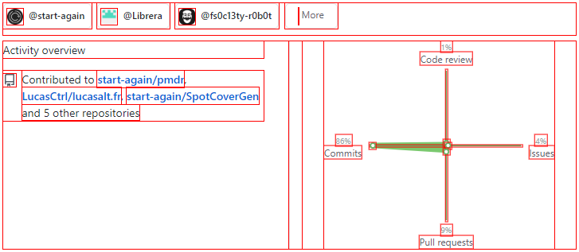
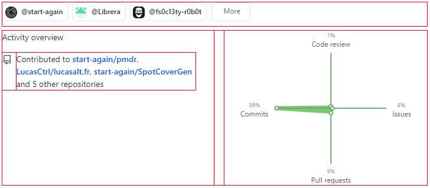

> Outline your components for easy CSS debugging

## 🌈 Different versions

### All elements
All elements will be outlined by a red border

### Only divs
All divs on the page will be outlined by a red border

## 📖 Usage

It's pretty easy to use this tool. You can try it by clicking on the links below. The first click enable the tool, and the second on disable it. If you would like to use it everywhere, you can simply drag and drop the link inside you bookmarks bar.

* <a href="javascript:/* debug.css | MIT License | lucasalt.fr/work/debug.css */ if (!('is_debugging' in window)) { is_debugging = false; var debug_el = document.createElement('style'); debug_el.append(document.createTextNode(`* { outline: 1px solid red !important }`)); } function enable_debugger() { if (!is_debugging) { document.head.appendChild(debug_el); is_debugging = true; } } function disable_debugger() { if (is_debugging) { document.head.removeChild(debug_el); is_debugging = false; } } !is_debugging ? enable_debugger() : disable_debugger();" >All elements version</a>
* <a href="javascript:/* debug.css | MIT License | lucasalt.fr/work/debug.css */ if (!('is_debugging' in window)) { is_debugging = false; var debug_el = document.createElement('style'); debug_el.append(document.createTextNode(`div { outline: 1px solid red !important }`)); } function enable_debugger() { if (!is_debugging) { document.head.appendChild(debug_el); is_debugging = true; } } function disable_debugger() { if (is_debugging) { document.head.removeChild(debug_el); is_debugging = false; } } !is_debugging ? enable_debugger() : disable_debugger();" >All divs version</a>

## 📝 License

Copyright © 2020 [LucasCtrl](https://github.com/LucasCtrl/debug.css/blob/master/LICENSE) 
This project is open source and available under the [MIT License](https://github.com/LucasCtrl/debug.css/blob/master/LICENSE)
