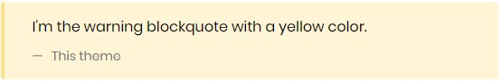
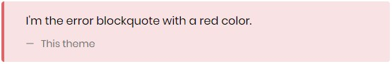

# How to use the blockquotes

## Default

```html
<blockquote>
  <p class="content">I'm the default blockquote with a grey color.</p>
  <p class="source">This theme</p>
</blockquote>
```


## Warning
```html
<blockquote class="warning">
  <p class="content">I'm the warning blockquote with a yellow color.</p>
  <p class="source">This theme</p>
</blockquote>
```


## Success
```html
<blockquote class="success">
  <p class="content">I'm the success blockquote with a green color.</p>
  <p class="source">This theme</p>
</blockquote>
```


## Error
```html
<blockquote class="error">
  <p class="content">I'm the error blockquote with a red color.</p>
  <p class="source">This theme</p>
</blockquote>
```

